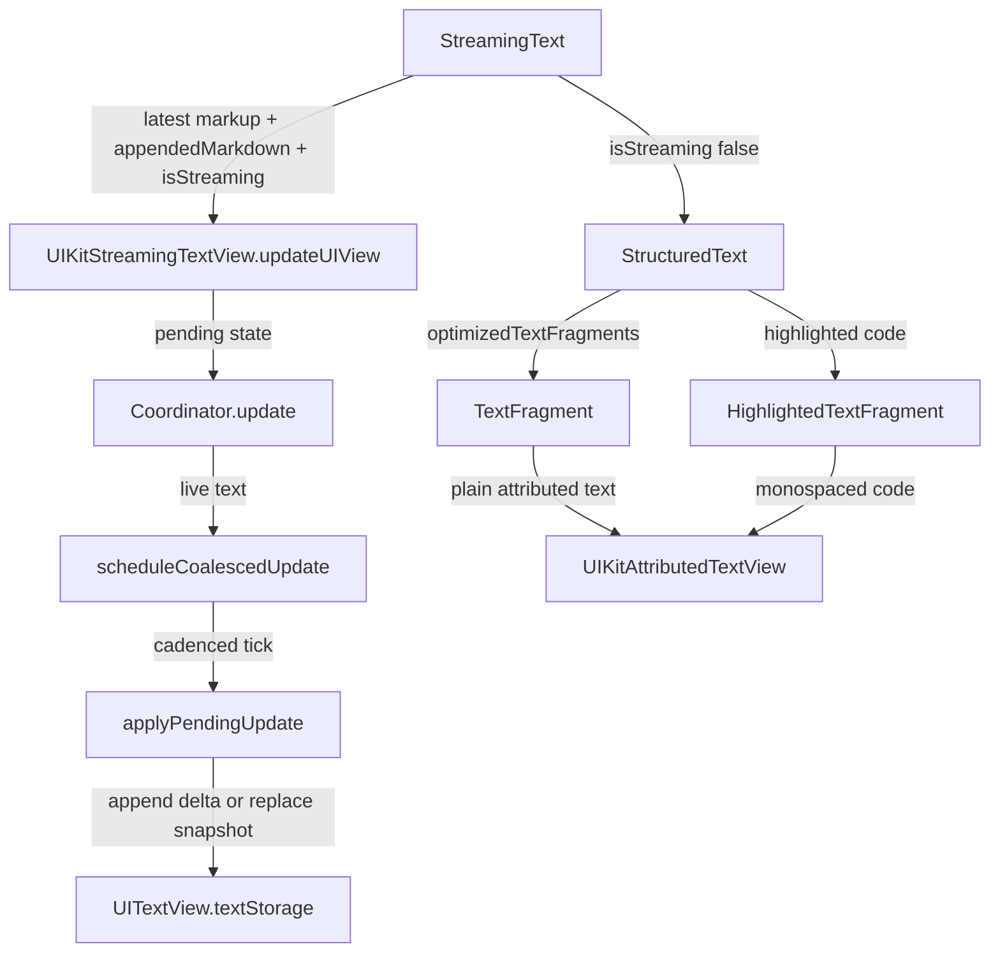
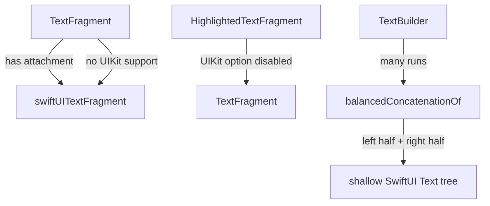

# Recap: Streaming Text Optimization
> Generated: 2026-05-18  |  Scope: 11 files changed

---

## Summary

The goal was to make AI response streaming much lighter for Remodex-style token updates while preserving copy/selection. Textual now has a UIKit-backed `StreamingText` view for live output, optimized UIKit text fragments for settled rich text and code blocks, and a safer balanced SwiftUI `Text` builder for fragmented fallback rendering. The current path keeps normal `StructuredText` behavior unchanged by default and opts into the faster UIKit fragment renderer through `StreamingText` or the public `.textual.optimizedTextFragments(...)` modifier.

---

## Files Affected

| File | Status | Role |
|---|---|---|
| `Sources/Textual/StreamingText/StreamingText.swift` | Created | Public streaming renderer backed by `UITextView` on UIKit platforms |
| `Sources/Textual/Internal/UIKit/UIKitAttributedTextView.swift` | Created | Shared UIKit rich-text fragment renderer for settled plain text and highlighted code |
| `Sources/Textual/Internal/UIKit/UIKitTextRenderingOptions.swift` | Created | Environment options that opt specific render paths into UIKit text fragments |
| `Sources/Textual/Internal/TextFragment/TextBuilder.swift` | Modified | Replaced linear recursive `Text` reduction with balanced concatenation |
| `Sources/Textual/Internal/TextFragment/TextFragment.swift` | Modified | Adds the opt-in UIKit fragment path while keeping the original SwiftUI path |
| `Sources/Textual/Internal/Highlighter/HighlightedTextFragment.swift` | Modified | Uses the UIKit fragment renderer for settled code blocks when the fast path is enabled |
| `Sources/Textual/View+Textual.swift` | Modified | Adds the public `.textual.optimizedTextFragments(...)` modifier for existing `StructuredText` integrations |
| `Tests/TextualTests/Internal/TextFragment/TextBuilderTests.swift` | Created | Guards highly fragmented text construction |
| `Tests/TextualTests/StreamingText/StreamingTextTests.swift` | Created | Verifies public streaming view and UIKit rendering option construction |
| `README.md` | Modified | Documents `StreamingText` usage and final UIKit fragment rendering behavior |
| `RECAP-streaming-text.md` | Created | Captures the implementation summary and flow |

---

## Logic Explanation

### Problem

Token-by-token AI responses can update the UI many times per second. Running the full Markdown parser, recursive block layout, attachment scans, and deep SwiftUI `Text` interpolation for every update can stall scrolling, gestures, and copy interactions.

### Approach

The fast path is a parallel public view instead of a replacement for `StructuredText`. `StreamingText` uses `UITextView` while text is live, coalesces bursts, mutates `textStorage` directly, and keeps native text selection/copy available. When `isStreaming` becomes false, it switches to `StructuredText` with an environment flag that lets plain text fragments and highlighted code blocks render through lightweight UIKit text views instead of the heavier SwiftUI fragment stack.

### Step-by-step

1. `StreamingText` receives the latest complete text snapshot, an optional appended delta, and an `isStreaming` flag.
2. On UIKit platforms, a `UIViewRepresentable` owns a non-editable, non-scrolling `UITextView` for the live stream.
3. While streaming, updates are coalesced to the configured cadence. If `appendedMarkdown` is supplied, the coordinator appends that delta without scanning the full response.
4. If the stream ends, the SwiftUI body renders final Markdown with `StructuredText` and enables `.textual.optimizedTextFragments(isSelectable: configuration.isSelectable)`.
5. `TextFragment` checks that option and uses `UIKitAttributedTextView` only when the fragment has no inline attachments. Attachment fragments stay on the original SwiftUI path so custom attachment overlays keep working.
6. `HighlightedTextFragment` uses the same UIKit renderer for code blocks when the fast path is enabled, with wrapping disabled and monospaced font design preserved.
7. Existing `StructuredText` call sites can use the same final-message optimization directly with `.textual.optimizedTextFragments(...)`.
8. The existing `TextBuilder` now concatenates SwiftUI `Text` values in a balanced tree, avoiding deep recursive chains for thousands of tiny runs whenever the fallback SwiftUI renderer is used.

### Tradeoffs & Edge Cases

The live stream path favors responsiveness over live Markdown styling. That is intentional: final Markdown renders once the response completes. The settled UIKit fragment path is opt-in, keeps native text selection/copy, and avoids Textual's custom selection overlay for that optimized streaming result. Fragments with attachments still use the original SwiftUI rendering path because overlay positions and attachment identity are more important than the small performance win there.

---

## Flow Diagram

### Happy Path

### Fallback Paths

---

## High School Explanation

Imagine the AI answer is being typed into the app super fast. The old rich-text path could try to redecorate the whole essay after almost every new word, which is like redoing the whole classroom board every time someone adds one letter.

The new streaming view uses a simpler board while the answer is still being written. It adds new text in small batches, so the app can still scroll and let you copy text. When the AI is done, Textual does the fancy formatting once.

For the finished answer, the plain paragraphs and code blocks can now use UIKit's native text box instead of building lots of tiny SwiftUI text pieces. Remodex can get that either by switching to `StreamingText` or by adding `.textual.optimizedTextFragments(...)` to an existing final `StructuredText`. If a piece contains a special embedded object, it still uses the older path, because those objects need careful placement. The backup SwiftUI path also glues tiny formatted pieces together in a balanced way, so a long answer does not turn into one huge chain of work.
